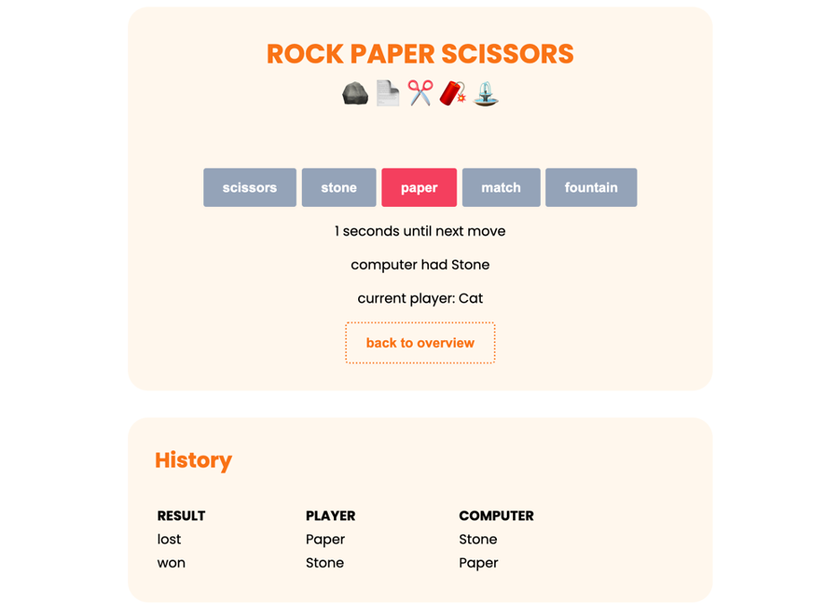

# How to not code a 🪨 📄 ✂️

### Vanilla JS rock paper scissors (fountain, match)
This is a rock paper scissors fountain match game, build without any JavaScript framework.
It's a good example of how grateful you should be for frontend frameworks.

## Demo
The demo is available <a href="https://vanilla-js-rock-paper-scissors.vercel.app">here</a>.

